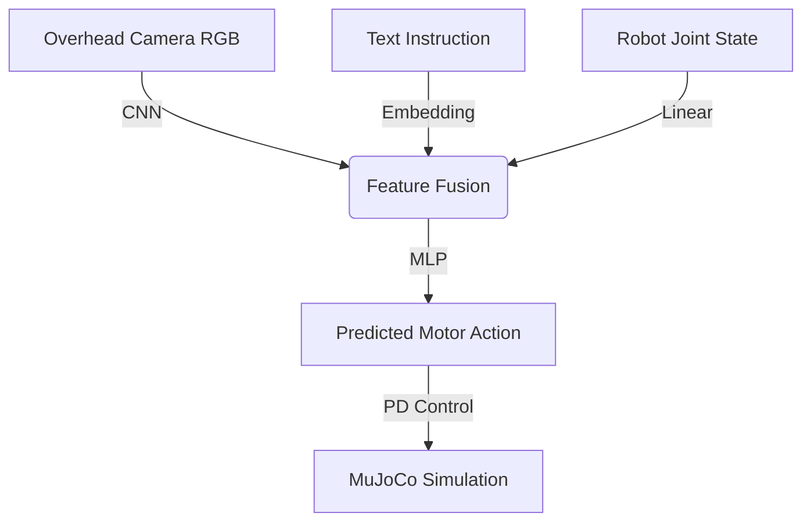

# NeuroVLA: Multimodal Behaviour Cloning in MuJoCo

**NeuroVLA** is a compact, end-to-end robot-learning pipeline that collects human teleoperation demonstrations and trains a multimodal PyTorch policy to predict continuous robot actions from RGB observations, task instructions, and robot state.

The project covers the complete workflow from demonstration collection to autonomous evaluation in a MuJoCo simulation. It is designed to run locally on Apple Silicon using PyTorch's MPS backend.

> **Scope:** NeuroVLA is a simulation-based behaviour-cloning prototype.
> Its language component uses a learned instruction embedding rather than
> a pretrained language model.

---

## 🛠️ Tech Stack

* **Physics Simulation:** mujoco, mujoco.viewer

* **Deep Learning:** PyTorch (Optimized for macOS mps backend)

* **Vision Processing:** OpenCV, numpy

## 🚀 How to Run

**1. Requirements**

NeuroVLA has been developed and tested with:

- Python 3.11
- PyTorch 2.13.0
- MuJoCo 3.11.0
- OpenCV 5.0.0
- NumPy 2.4.6
- macOS on Apple Silicon

**Setup**

Clone the repository:

git clone https://github.com/hasankara80/NeuroVLA.git
cd NeuroVLA

**2. Data Collection (Teleoperation)**

Drive the robot using W/A/S/D to push the block. Press R to record a demonstration.

mjpython data_collector.py

Saves RGB frames, text labels, and state-action pairs to vla_dataset/.

**3. Model Training**

Trains the multi-modal PyTorch policy on the collected dataset.

python train.py

**4. Autonomous Evaluation**

Runs the MuJoCo simulation without human input, driven entirely by the trained VLA policy conditioned on the text prompt.

mjpython eval.py

## 🧠 System Architecture

The agent fuses three distinct modalities to predict continuous motor control actions:

1. **Vision (The Eyes):** A Convolutional Neural Network (CNN) processes a 120x160 RGB camera feed from the MuJoCo renderer to establish spatial awareness of the tabletop and objects.
2. **Language (The Ears):** An Embedding layer encodes the text instruction (e.g., *"Push the red block"*) into a dense vector.
3. **State (The Proprioception):** A linear layer processes the robot's current joint angles.

These features are concatenated and passed through an MLP Action Head to output target motor angles.

## Current Results

The current NeuroVLA prototype was evaluated on the simulated block-pushing task.

| Metric | Result |
|---|---:|
| Recorded demonstrations | 497 |
| Training samples | 2982 |
| Training epochs | 30 |
| Final training loss | 0.0021 |
| Training time | 11 seconds 34 milliseconds |
| Evaluation episodes | 20 |
| Successful episodes | 18 |
| Task success rate | 90% |
| Training device | Apple Silicon MPS |

### Success Criterion

An episode is considered successful when the red block reaches the target area within the episode time limit without human input.
